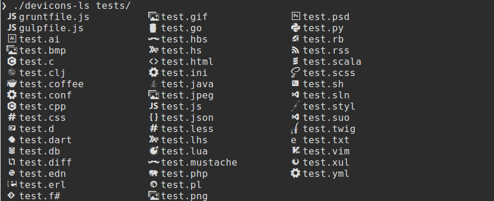
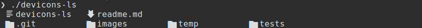
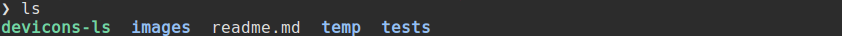

# Devicons Shell

> Show filetype glyphs (icons) in your terminal

Very much an experimental work in progress, Pull requests are very welcomed.

### Examples

> Using `devicons-ls`

> Using `ls`

> Using `devicons-ls`

> Using `ls`

### Requirements

A patched font from [Nerd Fonts](https://github.com/ryanoasis/nerd-fonts/tree/master/patched-fonts)

### Install

* Just run the script or copy it to ~/bin to run from anywhere
* Not recommended but you _could_ replace `ls` with this if you really wanted (reference [vim-devicons #150](https://github.com/ryanoasis/vim-devicons/issues/150))
  * Just copy the script to ~/bin and rename to 'ls'

## License

[MIT](LICENSE) © Ryan L McIntyre
